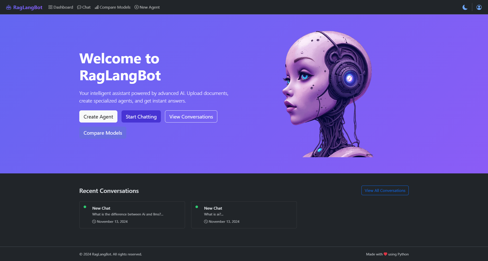

<div align="center">
  <h1>RagLangBot</h1>

  

  <p align="center">
    A powerful conversational AI platform combining state-of-the-art language models with RAG capabilities
  </p>

[](https://www.python.org/)
[](https://flask.palletsprojects.com/)
[](https://html.spec.whatwg.org/)
[](https://www.w3.org/Style/CSS/)
[](https://developer.mozilla.org/en-US/docs/Web/JavaScript)
[](https://opensource.org/licenses/MIT)
</div>

---

## 🌟 Features

### 🤖 Advanced AI Integration
- **Multiple LLM Support**: Seamless integration with Groq's cutting-edge models:
  - Gemma 7B & 2B
  - LLaMA 3.2 (90B, 11B variants)
  - Mixtral 8x7B
  - And more...
- **Model Comparison**: Side-by-side comparison with real-time performance metrics
- **Cost Analytics**: Detailed token usage and cost tracking per conversation

### 📚 Document Intelligence
- **RAG Capabilities**: 
  - Advanced document understanding with ChromaDB
  - Semantic search and retrieval
  - Context-aware responses
- **Multi-Format Support**:
  - PDF Processing (PyMuPDF)
  - Image Analysis (PIL)
  - Plain Text & Code Files
  - Smart format detection
- **Smart Chunking**: 
  - Intelligent document segmentation
  - Context preservation
  - Semantic splitting

### 🎯 Specialized Agents
- **Custom AI Agents**: 
  - Domain-specific intelligent assistants
  - Customizable model parameters
  - Training on specific documents
- **Knowledge Base**: 
  - Vector embeddings for efficient retrieval
  - Persistent document storage
  - Automatic context management
- **Interactive Features**:
  - Real-time conversations
  - Document upload during chat
  - Context-aware responses

## ⚙️ Installation

1. **Clone the Repository**
```bash
git clone https://github.com/yourusername/raglangbot.git
cd raglangbot
```

2. **Set Up Virtual Environment**
```bash
python -m venv venv

# Linux/macOS
source venv/bin/activate

# Windows
.\venv\Scripts\activate
```

3. **Install Dependencies**
```bash
pip install -r requirements.txt
```
4. **Environment setup**
```bash
Create a .env file with:

DATABASE_URL=sqlite:///instance/database.db
GROQ_API_KEY=your_groq_api_key
FLASK_SECRET_KEY=your_secret_key
```

5. **Initialize Database**
```bash
flask db upgrade
```

6. **Start Application**
```bash
flask run
```
## 🛠 Technical Stack

### Backend Framework
- **Flask 3.0.0**: Core web framework
- **Flask-SQLAlchemy 3.1.1**: Database ORM
- **Flask-Login 0.6.3**: User authentication
- **Flask-Migrate 4.0.5**: Database migrations
- **Python-dotenv 1.0.0**: Environment management

### AI & NLP Techniques
- **Langchain-groq 0.0.5**: LLM integration
- **Langchain-core 0.1.22**: Core LLM functionality
- **Chromadb 0.4.22**: Vector storage
- **Sentence-transformers 2.3.1**: Text embeddings
- **NLTK 3.8.1**: Natural language processing

### Document Processing
- **PyMuPDF 1.23.26**: PDF processing
- **python-docx 1.1.0**: Word documents
- **python-pptx 0.6.23**: PowerPoint files
- **openpyxl 3.1.2**: Excel processing
- **Pillow 10.2.0**: Image processing
- **pdfplumber 0.10.3**: Advanced PDF extraction

### Frontend
- **Core Technologies**: 
  - HTML5 & CSS3
  - Vanilla JavaScript with Fetch API
  - Tailwind CSS 3.4
- **Template System**: 
  - Jinja2 templating
  - Template inheritance
  - Dynamic content rendering
- **UI Features**:
  - Responsive design & dark mode
  - File upload with drag & drop
  - Real-time chat interface

## 🔒 Security

### Authentication
- Werkzeug password hashing
- Session management
- Login protection

### File Security
- Type validation
- Secure storage

### Data Protection
- SQLAlchemy query protection
- CSRF prevention
- Secure file handling

## 📝 License

This project is licensed under the MIT License.

## 🙏 Acknowledgments

- [Groq](https://groq.com/) for LLM API
- [ChromaDB](https://www.trychroma.com/) for vector storage
- [Flask](https://flask.palletsprojects.com/) framework
- [LangChain](https://www.langchain.com/) for LLM tools


<p align="center">
  Made with ❤️ using Python  <br />
  © 2024 RagLangBot
</p>
